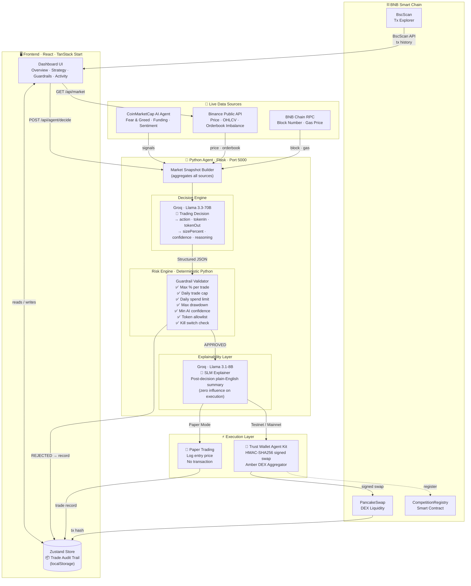
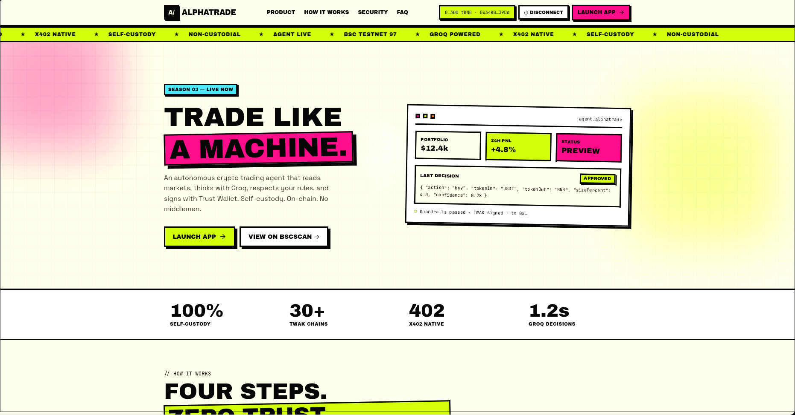
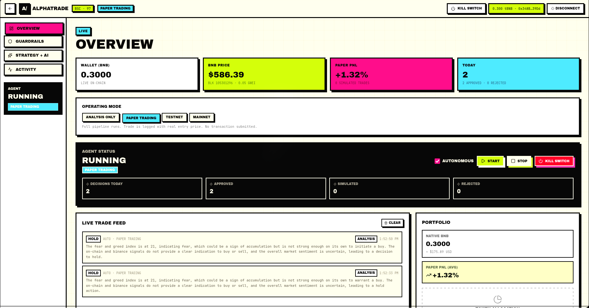
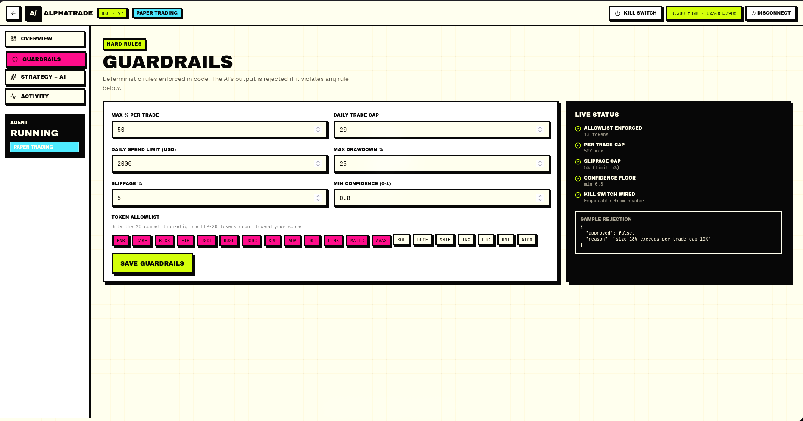
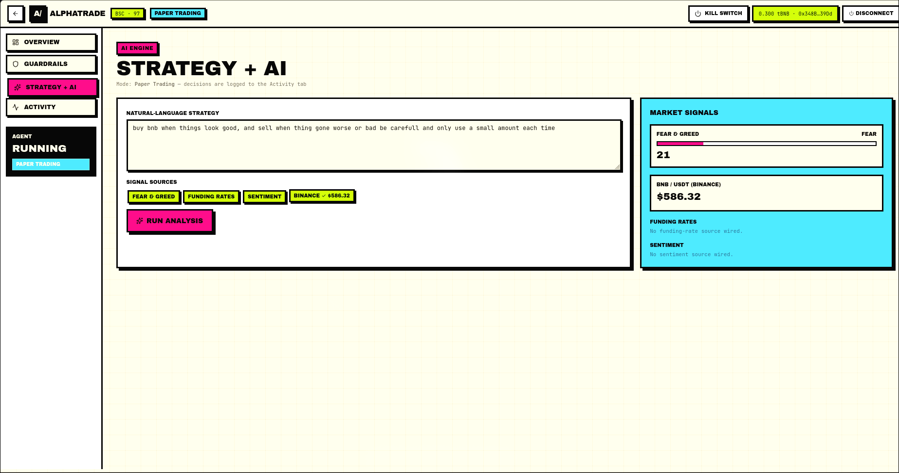
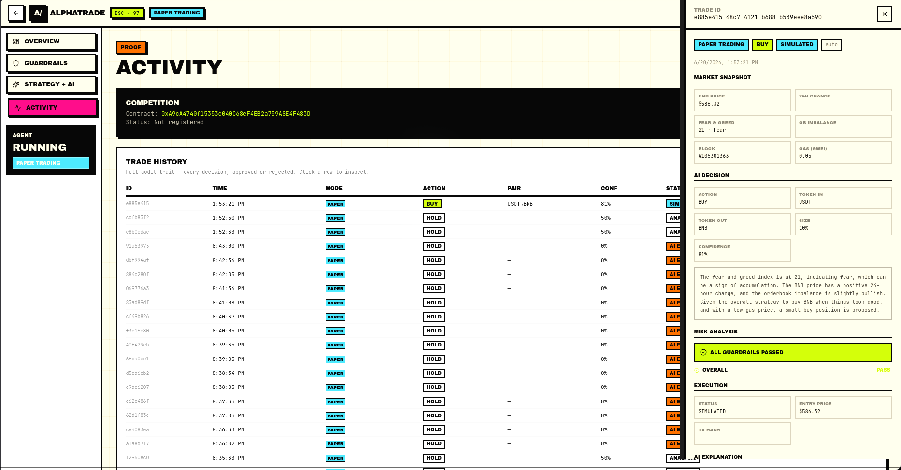

<div align="center">
  

  <br/>
  <br/>

  <p>
    
    
    
    
    
  </p>

  <h3>Autonomous AI Trading Agent for BNB Smart Chain</h3>
  <p>
    AlphaTrade is a production-grade autonomous trading system that combines large language models, live on-chain data, and deterministic risk controls to analyse, decide, and execute trades on BNB Chain — with a complete, auditable trail for every decision.
  </p>
</div>

---

## Table of Contents

- [Overview](#overview)
- [Architecture](#architecture)
- [How the AI Agent Pipeline Works](#how-the-ai-agent-pipeline-works)
- [AI Agents & Integrations](#ai-agents--integrations)
- [Operating Modes](#operating-modes)
- [Screenshots](#screenshots)
- [Tech Stack](#tech-stack)
- [Project Structure](#project-structure)
- [Getting Started](#getting-started)
- [Environment Variables](#environment-variables)
- [Developer](#developer)

---

## Overview

AlphaTrade is built around a single design principle:

> **AI proposes. Code validates. Wallet executes.**

A large language model continuously monitors live market conditions and suggests trading actions. Every suggestion is evaluated against a set of hard, deterministic guardrails written in Python before any execution step is triggered. The AI can never bypass safety rules — they live in code, not in another model.

**Key capabilities:**

- **Autonomous loop** — agent runs on a configurable timer, analysing market data and deciding trades without manual intervention
- **Groq Llama 3.3-70B** — primary trading intelligence; reads market signals and outputs structured JSON decisions
- **SLM Explanation** — a second, smaller model (Llama 3.1-8B) writes a plain-English summary of every decision after the fact — for auditability, not for influence
- **Deterministic guardrails** — max trade size, daily cap, drawdown limit, slippage, min confidence, token allowlist — all enforced in Python before execution
- **Trust Wallet Agent Kit (TWAK)** — server-side swap execution via the Amber DEX aggregator on BNB Chain
- **CoinMarketCap AI Agent** — live Fear & Greed index, funding rates, and market sentiment signals
- **BNB AI Agent SDK** — on-chain identity registration (ERC-8004) and job server (ERC-8183)
- **Full audit trail** — every trade logged with its market snapshot, AI output, guardrail result, execution status, and plain-English explanation

---

## Architecture



---

## How the AI Agent Pipeline Works

Each decision cycle runs through a strict, ordered pipeline. No step can be skipped.

### Step 1 — Data Collection (parallel)

Three data sources are queried simultaneously at the start of each cycle:

| Source | Data | Provider |
|--------|------|----------|
| CoinMarketCap AI Agent | Fear & Greed Index, funding rates, sentiment | CMC Agent API |
| Binance Public API | BNB/USDT price, 24h change, orderbook imbalance, OHLCV candles | No key required |
| BNB Chain RPC | Latest block number, gas price in Gwei | Public testnet RPC |

These are combined into a `MarketSnapshot` that is timestamped and stored with the final trade record.

### Step 2 — AI Decision (Groq · Llama 3.3-70B)

The market snapshot and the user's plain-English strategy are sent to Groq. The model is prompted to output a strictly structured JSON object:

```json
{
  "action": "buy",
  "tokenIn": "USDT",
  "tokenOut": "BNB",
  "sizePercent": 5,
  "confidence": 0.78,
  "reasoning": "Fear & Greed at 72 (Greed) combined with positive funding rate and rising BNB price suggests short-term upside momentum."
}
```

The model cannot write freeform text here — it must conform to this schema or the response is rejected.

### Step 3 — Guardrail Validation (deterministic Python)

Every field in the AI's JSON is checked against the user's guardrails **in code**. There is no second AI involved — these are plain conditional statements:

- `sizePercent <= maxPerTradePct` — trade is not too large
- `tradesExecutedToday < dailyTradeCap` — daily limit not reached
- `totalSpentToday + tradeUsdValue <= dailySpendLimitUsd` — spend cap not exceeded
- `portfolioDrawdown <= maxDrawdownPct` — losses not beyond tolerance
- `confidence >= minConfidence` — AI is confident enough to act
- `tokenIn in allowlist and tokenOut in allowlist` — tokens are permitted
- `killSwitch == false` — emergency stop not engaged

If **any** check fails, the trade is rejected immediately. The rejection reason and which specific check failed are recorded.

### Step 4 — SLM Explanation (Groq · Llama 3.1-8B)

After the guardrail decision (pass or fail), a smaller, faster model generates a one-paragraph plain-English explanation of what happened and why. This model has **no influence on execution** — it only explains the decision that was already made.

### Step 5 — Execution

Based on the operating mode:

| Mode | What happens |
|------|-------------|
| Analysis Only | Decision shown in UI, nothing logged |
| Paper Trading | Trade logged with real Binance entry price. No transaction submitted. |
| Testnet | TWAK signs a swap and submits it to BSC Testnet via the Amber DEX aggregator |
| Mainnet | Same as testnet, on the real BNB Chain. Gated behind the kill switch. |

### Step 6 — Audit Trail

The complete record is persisted to localStorage via Zustand:

- Market snapshot at exact decision time
- Full AI JSON output
- Per-guardrail PASS / FAIL map
- Execution status, entry price, and tx hash (if live)
- SLM plain-English explanation

Every record is accessible from the Activity page's Trade Detail Drawer.

---

## AI Agents & Integrations

### Groq — Primary Trading Intelligence

**Model:** `llama-3.3-70b-versatile`

The core decision engine. Receives the market snapshot and user strategy, returns a structured trading decision. Hosted on Groq's inference infrastructure for low-latency responses critical to the trading loop.

**Model:** `llama-3.1-8b-instant` (SLM Explainer)

A separate, lighter model that runs after every decision to generate a human-readable explanation. Runs at lower temperature (0.4) for factual, consistent output. Kept intentionally separate from the decision model to prevent explanation bias from influencing future cycles.

---

### Trust Wallet Agent Kit (TWAK)

TWAK is the **sole execution layer** for live trades. All swap signing happens server-side using HMAC-SHA256 authentication — the private key never reaches the browser.

**Authentication:**
```
string_to_sign = METHOD;PATH;QUERY;ACCESS_ID;NONCE;DATE   (semicolons)
signature      = base64( HMAC-SHA256(string_to_sign, HMAC_SECRET) )
Authorization  : HMAC-SHA256 Signature=<base64>
Date           : RFC 1123 / HTTP-date in GMT
```

**Swap flow:**
```
Step 1: POST /amber-api/v1/route      → get quote from Amber DEX aggregator
Step 2: POST /amber-api/v1/route/step → execute the swap step
        ↓
   Transaction hash returned
        ↓
   Verified on BscScan
```

The Amber aggregator routes through PancakeSwap and other BNB Chain DEXs to find the best available price at execution time.

---

### CoinMarketCap AI Agent Hub

AlphaTrade connects to the CoinMarketCap AI Agent platform for two categories of signals:

- **Fear & Greed Index** — market-wide sentiment score (0–100). Used as a primary buy/sell signal in the default strategy.
- **Funding Rates & Sentiment** — derivatives market positioning data used alongside price action to assess momentum direction.

These signals are fetched once per decision cycle and stored in the market snapshot, making every decision traceable back to the exact sentiment data that influenced it.

---

### BNB AI Agent SDK

The BNB AI Agent SDK provides on-chain identity and job infrastructure:

- **ERC-8004** — on-chain agent identity registration. AlphaTrade registers itself as a verifiable on-chain agent, establishing a cryptographic identity on BNB Chain.
- **ERC-8183** — job server protocol. `agent_server.py` runs a compliant job server (port 8003 via uvicorn) that allows external systems to submit trading jobs to the agent in a standardised format.
- **CompetitionRegistry** — a Hardhat-deployed smart contract on BSC Testnet that records agent registration on-chain. Verified on BscScan.

---

## Operating Modes

| Mode | Description | Money at risk |
|------|-------------|---------------|
| **Analysis Only** | AI runs and displays its decision. Nothing is recorded or executed. | None |
| **Paper Trading** | Full pipeline runs. Trade logged with real Binance entry price. No swap submitted. Paper PnL tracked across sessions. | None |
| **Testnet** | Real swap submitted to BSC Testnet (Chain ID 97) via TWAK and Amber aggregator. Uses testnet BNB (no real value). | None |
| **Mainnet** | Real swap on BNB Mainnet. Gated behind kill switch. | Real BNB |

The current mode is always visible in the dashboard header. A trade record's mode badge is permanent — a paper trade can never be confused with a live one.

---

## Screenshots

### Landing Page



---

### Overview — Live Dashboard



The overview page shows live on-chain wallet balance, real-time BNB price from Binance, Paper PnL across simulated trades, and the autonomous agent control panel with kill switch.

---

### Guardrails — Risk Controls



Hard rules enforced in deterministic Python code. Max trade size, daily caps, drawdown limits, slippage tolerance, minimum AI confidence threshold, and a token allowlist. The AI's output is rejected if any single rule is violated.

---

### Strategy + AI — Decision Engine



User defines their strategy in plain English. The AI reads this alongside live signals — Fear & Greed, BNB price, gas costs — and returns a structured decision with reasoning. The risk engine validates it and the SLM writes a plain-English explanation below.

---

### Activity — Audit Trail



Complete trade history with a per-trade detail drawer. Each drawer shows the exact market snapshot at decision time, the full AI output, per-guardrail PASS/FAIL status, execution details, and the SLM explanation. Every number is traceable.

---

## Tech Stack

### Frontend

| Technology | Role |
|-----------|------|
| React 19 | UI framework |
| TanStack Start | SSR framework (file-based routing, server routes) |
| TanStack Query | Data fetching, background refetch |
| TanStack Router | Type-safe file-based routing |
| Zustand + localStorage | Persistent state (trade audit trail, guardrails, settings) |
| wagmi + viem | Wallet connection (MetaMask / WalletConnect), on-chain reads |
| Tailwind CSS v4 | Styling |
| Framer Motion | Animations |
| Zod + React Hook Form | Form validation (guardrails) |
| Sonner | Toast notifications |
| Lucide React | Icons |

### Python Agent

| Technology | Role |
|-----------|------|
| Flask 3 + flask-cors | API server |
| Groq Python SDK | Llama 3.3-70B (decisions) + Llama 3.1-8B (explanations) |
| BNB AI Agent SDK | ERC-8004 identity + ERC-8183 job server |
| Pydantic v2 | Request / response schema validation |
| Gunicorn + uvicorn | WSGI / ASGI servers |
| python-dotenv | Environment configuration |

### Blockchain & Execution

| Technology | Role |
|-----------|------|
| BNB Smart Chain (Chain ID 97) | Target blockchain (testnet) |
| Trust Wallet Agent Kit (TWAK) | Server-side swap execution via Amber DEX |
| PancakeSwap (via Amber) | DEX liquidity for BNB ↔ USDT swaps |
| Hardhat | CompetitionRegistry smart contract deployment |
| BscScan API | On-chain transaction history |

### External Data

| Provider | Data |
|---------|------|
| Binance Public API | BNB/USDT price, OHLCV candles, orderbook depth |
| CoinMarketCap AI Agent | Fear & Greed index, funding rates, sentiment |
| BNB Chain Public RPC | Block number, gas price |

---

## Project Structure

```
AlphaTrade/
├── src/                          # TanStack Start frontend
│   ├── routes/
│   │   ├── index.tsx             # Landing page
│   │   ├── dashboard.tsx         # Dashboard shell (sidebar, header)
│   │   ├── dashboard.index.tsx   # Overview page
│   │   ├── dashboard.guardrails.tsx
│   │   ├── dashboard.strategy.tsx
│   │   ├── dashboard.activity.tsx
│   │   └── api/
│   │       ├── agent/decide.ts   # Proxy → Python Agent
│   │       ├── market.ts         # Proxy → Binance via Python Agent
│   │       ├── signals.ts        # CoinMarketCap signals
│   │       ├── bnb/context.ts    # BNB Chain block + gas
│   │       ├── chain/txs.ts      # BscScan tx history
│   │       └── twak/             # TWAK signed endpoints
│   ├── lib/
│   │   ├── store.ts              # Zustand store (trades, guardrails, mode)
│   │   ├── wagmi.ts              # Wallet config (BSC Testnet)
│   │   ├── agent/
│   │   │   └── useAgentLoop.ts   # Autonomous agent hook
│   │   └── services/
│   │       ├── twClient.ts       # TWAK HMAC signing (server-only)
│   │       ├── twakService.ts    # TWAK swap + balance methods
│   │       └── cmcService.ts     # CoinMarketCap signals
│   └── components/
│       ├── brutal/               # Design system components
│       └── wallet-button.tsx
│
├── Agent/                        # Python AI Agent (Flask · port 5000)
│   ├── app/
│   │   ├── __init__.py           # App factory, service wiring
│   │   ├── controllers/
│   │   │   └── agent_controller.py
│   │   ├── services/
│   │   │   ├── groq_service.py   # Llama 3.3-70B trading decisions
│   │   │   ├── explanation_service.py  # Llama 3.1-8B SLM explainer
│   │   │   ├── binance_service.py      # Price, OHLCV, orderbook
│   │   │   ├── guardrail_service.py    # Deterministic risk validation
│   │   │   └── bnb_context_service.py  # On-chain block + gas
│   │   └── views/
│   │       ├── agent.py          # POST /api/agent/decide
│   │       └── market.py         # GET  /api/market
│   ├── agent_server.py           # ERC-8183 job server (port 8003)
│   └── wsgi.py                   # Gunicorn entry point
│
├── blockchain/                   # Hardhat (CompetitionRegistry contract)
│   ├── contracts/
│   └── scripts/
│
├── imgs/                         # Screenshots and banner
├── .env.example                  # Environment variable reference
├── workflow.md                   # Architecture and operational docs
├── demo.md                       # Step-by-step demo guide
└── script.md                     # Video demo script
```

---

## Getting Started

### Prerequisites

- Node.js 20+
- Python 3.11+
- MetaMask browser extension configured for BSC Testnet (Chain ID 97)

### 1. Clone and install

```bash
git clone <repo-url>
cd AlphaTrade
npm install
```

```bash
cd Agent
pip install -r requirements.txt
```

### 2. Configure environment

```bash
cp .env.example .env
# Fill in your credentials — see Environment Variables below
```

### 3. Start the Python Agent

```bash
cd Agent
python wsgi.py
# Running on http://127.0.0.1:5000
```

### 4. Start the frontend

```bash
# From project root
npm run dev
# Running on http://localhost:3000
```

### 5. Open the dashboard

Navigate to `http://localhost:3000`, connect MetaMask on BSC Testnet, and set the operating mode to **Paper Trading** to begin.

---

## Environment Variables

### Frontend (`.env`)

| Variable | Required | Description |
|----------|----------|-------------|
| `VITE_CHAIN_ID` | Yes | `97` for BSC Testnet, `56` for Mainnet |
| `VITE_BSC_RPC_URL` | Yes | BNB Chain RPC endpoint |
| `VITE_COMPETITION_CONTRACT` | For registration | Deployed CompetitionRegistry address |
| `VITE_WALLETCONNECT_PROJECT_ID` | For WalletConnect | Project ID from cloud.walletconnect.com |
| `AGENT_API_URL` | Yes | Python Agent URL (default: `http://localhost:5000`) |
| `CMC_AGENT_API_KEY` | For signals | CoinMarketCap AI Agent API key |
| `BSCSCAN_API_KEY` | For tx history | BscScan API key (free) |
| `TW_ACCESS_ID` | For live trading | Trust Wallet portal Access ID |
| `TW_HMAC_SECRET` | For live trading | Trust Wallet portal HMAC secret |
| `TWAK_AGENT_ADDRESS` | For live trading | Agent wallet address (your `0x...`) |
| `GROQ_API_KEY` | Yes | Groq API key (groq.com) |
| `BNB_AGENT_KEY` | For ERC-8004 | BNB AI Agent SDK key |

### Python Agent (`.env` in `Agent/`)

The Python Agent reads the same `.env` file placed in the project root. Ensure `GROQ_API_KEY` and `CMC_AGENT_API_KEY` are set before starting.

---

## Developer

<div align="center">

**Built by**

## PRIEYAN SANJAY E

*Autonomous AI Trading · BNB Smart Chain*

---

*AlphaTrade is an autonomous trading system built on BNB Smart Chain. It is not financial advice. Paper Trading and Testnet modes exist precisely so the system can be evaluated safely without real capital at risk.*

</div>
